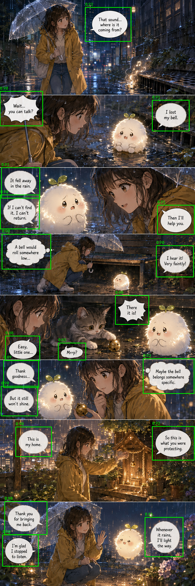

# TOONTRA Public Reconstruction

This repository recreates parts of a webtoon localization system I previously worked on.

The original production code, internal datasets, and company-trained weights
are not included. This version uses public datasets and separately trained
public models.

It currently includes:

- speech-bubble detection;
- tiled inference for long webtoon pages;
- tile ownership and NMS deduplication;
- ROI expansion;
- bubble masking and segmentation;
- optional OCR and translation; and
- extension interfaces for other localization components.

## Pipeline

```text
RGB page
  -> bubble detector (YOLO26, tiled + deduplicated + expanded)
  -> bubble masker (WhiteBubbleMasker or optional MA-Net)
  -> full-page mask and cleaned page
  -> optional OCR
  -> optional translation
  -> PNG artifacts and JSON metadata
```

`Yolo26BubbleDetector` and the weight-free `WhiteBubbleMasker` are the
defaults. `ManetBubbleMasker` is an optional MA-Net-based alternative that uses
a separate checkpoint. Custom implementations can be used for the other pipeline
components as well; see [docs/custom_models.md](docs/custom_models.md).

## Installation

```console
python -m pip install -e .
```

Development tools and optional components:

```console
python -m pip install -e ".[dev]"
python -m pip install -e ".[ocr]"
python -m pip install -e ".[manet]"
```

Python 3.10 or newer is required.

## Quick Start

### CLI

Run the full pipeline on the offline procedural demo:

```console
toontra demo --output demo_output
```

The demo is only meant to check that the pipeline runs correctly.
To process a PNG or JPEG page:

```console
toontra process path/to/page.png --output outputs/page
```

Long pages are tiled automatically when they exceed 1600 pixels in height, using 256 pixels of overlap. You can adjust these values if needed:

```console
toontra process path/to/long_page.png --output outputs/page \
    --tile-height 2000 --tile-overlap 320
```

The output directory contains `cleaned.png`, `mask.png`, `overlay.png`, and
`result.json`. Add `--save-crops` to save bubble crops. `--force` permits
known output files to be overwritten; unrelated files are left unchanged.

Run the bundled detector on the included AI-generated sample page:

```console
python examples/run_bubble_detection.py
```

This writes `examples/output/detections.png` and
`examples/output/detections.json`. The sample is not part of an evaluation
benchmark and has no ground-truth annotations.



### Python API

```python
from toontra import Toontra

toontra = Toontra()
results = toontra.process(["page_01.png", "page_02.png"])

for page in results:
    for bubble in page.bubbles:
        box = bubble.detection.box.as_tuple()
        text = bubble.recognition.text if bubble.recognition else None
        translation = bubble.translation
```

A single path or RGB `uint8` NumPy array returns one `PageResult`; a sequence
returns a list. Box coordinates use half-open `xyxy` bounds, so
`image[y1:y2, x1:x2]` extracts the recorded region.

## Models

### YOLO26

`Yolo26BubbleDetector` is the default detector. It uses the bundled
`speech_bubble_yolo26s.pt` checkpoint, which was fine-tuned for this reconstruction
on a public speech-bubble dataset. The default inference image size is 800 pixels.

See [docs/model_choices.md](docs/model_choices.md) for training provenance and
[THIRD_PARTY_NOTICES.md](THIRD_PARTY_NOTICES.md) for dependency licenses.

### MA-Net

`ManetBubbleMasker` uses an MA-Net model with a ResNet34 encoder for speech-bubble
segmentation. The checkpoint is distributed separately and is not stored in this repository.

- Filename: `toontra_manet_resnet34_bubble_segmentation.pth`
- Checkpoint: [toontra-research/toontra-manet-bubble-segmentation](https://huggingface.co/toontra-research/toontra-manet-bubble-segmentation)
- Optional dependencies: `python -m pip install -e ".[manet]"`

Supply the checkpoint path explicitly; the model is not downloaded
automatically.

```console
toontra process page.png --output outputs/page \
    --masker manet \
    --manet-checkpoint weights/toontra_manet_resnet34_bubble_segmentation.pth
```

```python
from toontra import Toontra
from toontra.modules import ManetBubbleMasker

masker = ManetBubbleMasker(
    "weights/toontra_manet_resnet34_bubble_segmentation.pth"
)
toontra = Toontra(masker=masker)
```

The checkpoint was trained on Roboflow `manga-segment_v2`, version 5.
Preprocessing and checkpoint metadata are documented in
[docs/custom_models.md](docs/custom_models.md).

### OCR

EasyOCR is available through the optional `EasyOcrRecognizer` adapter:

```console
python -m pip install -e ".[ocr]"
toontra process page.png --output outputs/page --ocr easyocr \
    --source-language ko --allow-model-download
```

EasyOCR may download language weights when the reader is created, so the CLI
requires `--allow-model-download`. OCR is disabled by default.

## Long Webtoon Processing

Pages taller than `tile_height` are processed as overlapping vertical tiles. Tile-level
detections are mapped back to full-page coordinates and deduplicated using tile ownership
followed by non-maximum suppression (NMS).

Tile ownership assigns detections according to the position of their center within the
overlap region. NMS is then applied to remove any remaining duplicate detections.

After deduplication, each box is expanded once by 5% of its width on the left
and right and 5% of its height on the top and bottom. The expanded box is used
for masking, OCR, and reported output. No masker, including MA-Net, expands it
again. Local masks are combined with a pixel-wise maximum before the page is
cleaned.

## Evaluation

### YOLO26 training validation

The best epoch by mAP50-95 was 90 of 100 at image size 800 and batch size 8.

| Metric | Value |
| --- | ---: |
| Precision | 0.9740 |
| Recall | 0.9811 |
| mAP50 | 0.9906 |
| mAP50-95 | 0.8352 |

Sources:
[results.csv](evaluation/source/yolo26/results.csv),
[args.yaml](evaluation/source/yolo26/args.yaml), and
[yolo26_training_summary.json](evaluation/yolo26_training_summary.json).

### Independent webtoon benchmark

The full tiled pipeline was evaluated on 367 manually annotated speech
bubbles across three webtoons using 1600 px tiles with 256 px overlap.

| Metric | Value |
| --- | ---: |
| TP / FP / FN | 329 / 19 / 38 |
| Precision | 0.945 |
| Recall | 0.896 |
| F1 | 0.920 |

On this benchmark, ownership-based cross-tile selection followed by same-tile
NMS produced the same aggregate result as global NMS. The ownership rule can
change which duplicate is retained near tile boundaries, but with the current
YOLO26 detector this did not change the final TP, FP, or FN counts. See
[evaluation/detector_benchmark.json](evaluation/detector_benchmark.json).

### MA-Net segmentation

Verified results from [docs/training/manet_results.json](docs/training/manet_results.json):

| Metric | Value |
| --- | ---: |
| Validation Dice | 0.9828 |
| Held-out test Dice | 0.9805 |
| Held-out test IoU | 0.9622 |

The best epoch was 18, using a 0.45 threshold, 512-pixel inputs, and 0.15 crop
padding on `manga-segment_v2` version 5.

## Benchmark Dataset

The benchmark contains three source images with 204, 40, and 123 annotations,
respectively. Source artwork is not redistributed. Dataset documentation,
annotations, and official source links are in
[evaluation/benchmark/](evaluation/benchmark/).

## Custom Components

`Toontra` accepts detector, masker, recognizer, and translator implementations
as constructor arguments:

```python
toontra = Toontra(
    detector=my_detector,
    masker=my_masker,
    recognizer=my_ocr,
    translator=my_translator,
)
```

The expected interfaces for RGB input, detection, masking, OCR, and translation are
documented in [docs/custom_models.md](docs/custom_models.md), with working examples in
[examples/custom_components.py](examples/custom_components.py). Interfaces
for text detection, inpainting, font matching, text reinsertion, and image
enhancement are present but not implemented in this reconstruction.

## Limitations

- Detector performance varies with art style and page layout.
- `WhiteBubbleMasker` is designed for light bubble interiors; MA-Net is the
  optional segmentation-model alternative.
- Masking fills selected regions with a flat color and does not reconstruct
  artwork behind text.
- Transparent inputs are flattened onto white; images above 8 bits per channel
  are rejected.
- OCR quality depends on the lettering style and external OCR models.
- The pipeline does not place translated text back into the image.

## Tests

```console
python -m pip install -e ".[dev]"
ruff check .
pytest
```

Most automated tests use lightweight test components so they can run without model
checkpoints. YOLO and MA-Net have separate model-specific tests. Tests that require
the MA-Net checkpoint run only when the checkpoint path is provided.

## License

The original code in this reconstruction is available under the MIT License.
Bundled weights, dependencies, public datasets, and optional model artifacts
retain their applicable terms; see
[THIRD_PARTY_NOTICES.md](THIRD_PARTY_NOTICES.md).
